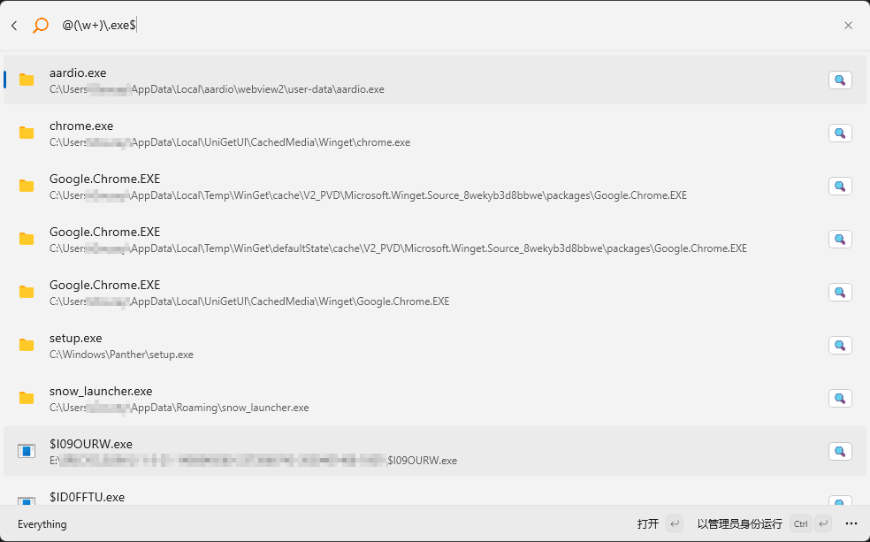

# EverythingExtension

EverythingExtension 是一个用于 Windows 的命令面板扩展，它允许您通过命令面板快速访问 Everything 数据库中的文件和文件夹。


## 使用方法
1. 输入 `Everything`（或选择 `Everything 搜索`）以打开 Everything 命令面板。
2. 在命令面板中输入 `搜索关键字` 进行搜索。
3. 在搜索结果中，选择要打开的文件或文件夹，按 Enter 键进行打开。
4. 您还可以使用其他快捷键和功能(Ctrl+K)来操作搜索结果。
5. 搜索中可以使用内置 `宏` （设置中需要开启宏搜索）具有针对性的搜索，例如：`doc:、audio:、zip:、pic:、video:、web:、exe:`等。

## `宏` 搜索说明（支持的文件类型）
- `doc:`：搜索文档文件，如 .doc、.docx、.pdf 等。
  > c,chm,cpp,doc,dot,h,htm,html,mht,mhtml,nfo,pdf,pps,ppt,rtf,txt,vsd,wpd,wps,wri,xls,xml,txt,docx,htm,html,pdf,c,cpp,h,xls,odp,odt,ods,pptx,xlsx,csv,docx,ppsx,java,hpp,ini,dotx,xlsb

- `audio:`：搜索音频文件，如 .mp3、.wav、.flac 等。
  > aac,ac3,aif,aifc,aiff,au,cda,dts,fla,flac,gym,it,m1a,m2a,m4a,midi,mka,mod,mp2,mp3,mpa,ogg,ra,spc,rmi,snd,umx,vgm,vgz,voc,wav,wma,xm

- `zip:`：搜索压缩文件，如 .zip、.rar、.7z 等。
  > ace,arj,bz2,cab,gz,gzip,r00,r01,r02,r03,r04,r05,r06,r07,r08,r09,r10,r11,r12,r13,r14,r15,r16,r17,r18,r19,r20,r21,r22,r23,r24,r25,r26,r27,r28,r29,rar,tar,7z，zip

- `pic:`：搜索图片文件，如 .jpg、.png、.gif 等。
  > ani,bmp,gif,ico,jpe,jpeg,jpg,pcx,png,psd,tga,tif,tiff,wmf,wbmp,icl,jp2,mpng,raw,nef,wdp,hdp

- `video:`：搜索视频文件，如 .mp4、.avi、.mkv 等。
  > 3g2,3gp,3gp2,3gpp,amr,asf,avi,bik,d2v,dat,divx,drc,dsa,dsm,dss,dsv,flc,fli,flic,flv,ifo,ivf,m1v,m2v,m4b,m4p,m4v,mkv,mp2v,mp4,mpe,mpeg,mpg,mpv2,mov,ogm,pss,pva,qt,ram,ratdvd,rm,rmm,roq,rpm,smk,swf,tp,tpr,ts,vob,vp6,wm,wmp,wmv,rmvb

- `web:`：搜索网页文件，如 .html、.htm、.php 等。
  > html,htm,mht,php,css,sql,js

- `exe:`：搜索可执行文件，如 .exe、.msi、.bat 等。
  > exe,cmd,msi,msix

## 搜索参数
- 常规搜索
  > 输入关键词即可搜索

- 宏搜索
  > 宏标记:搜索关键词

  例如:

  ```
  pic:1212
  ```

- 自定义搜索结果数量（数量最大取值100，超过100会导致崩毁）
  > 用于自定义返回搜索结果；搜索规则：搜索关键词 count:数量；

  例如：
  ```
  hello count:10
  ```

- 开启正则搜索
   用 `@` 开头则启用正则搜索，需要注意的是，启用正则搜索时，无法启用`宏`搜索 和 `自定义返回结果数量公告`


### 常规搜索


### 宏搜索


### 宏搜索带自定义返回数量


### 正则搜索


### 正则搜索带自定义返回数量

